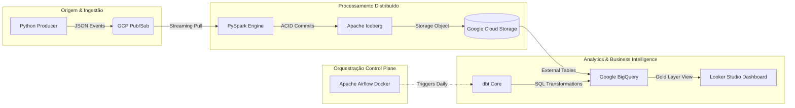

# Enterprise Financial Lakehouse: Real-Time Ingestion, Iceberg Storage, and Analytics Orchestration

[](https://cloud.google.com/)
[](https://spark.apache.org/)
[](https://iceberg.apache.org/)
[](https://www.getdbt.com/)
[](https://airflow.apache.org/)
[](https://www.docker.com/)

## 🎯 1. O Cenário de Negócio & Desafio Tech

Em grandes instituições financeiras, a latência e a inconsistência dos dados são inimigas críticas da tomada de decisão. O objetivo deste projeto foi projetar e implementar uma plataforma de dados de ponta a ponta robusta, capaz de capturar eventos transacionais em tempo real (PIX, TED, Cartão de Crédito), garantir a durabilidade e integridade dessas mensagens em um Data Lakehouse moderno e expor métricas analíticas diárias de alto nível para a diretoria financeira.

### O Desafio de Resiliência (Incidente de Julho de 2026)
Como prova de conceito da resiliência do ecossistema e desacoplamento da arquitetura, simula-se um cenário real de desastre: **o motor de processamento ficou indisponível entre os dias 07/07/2026 e 12/07/2026**. Graças à camada de mensageria assíncrona, nenhum dado foi perdido e um processo de **Backfill** retroativo foi executado com sucesso para repovoar o histórico e reprocessar as métricas sem impactar o relatório final.

---


## 🏗️ 2. Arquitetura da Solução

O desenho técnico segue o padrão de arquitetura desacoplada moderno, separando o **Control Plane** (Plano de Controle/Orquestração) do **Data Plane** (Plano de Execução/Processamento de Dados).



## 🧠 3. Escolhas Tecnológicas & Justificativas Técnicas

*   **GCP Pub/Sub:** Escolhido como camada de mensageria por ser uma ferramenta serverless de alta escalabilidade. Ele atua como o amortecedor (*buffer*) do pipeline. Se a taxa de transações por segundo explodir, ele retém as mensagens por até 7 dias, protegendo os sistemas de processamento downstream contra sobrecarga.
*   **PySpark:** O motor escolhido para o processamento distribuído de streaming devido à sua capacidade de lidar com computação em memória de grandes volumes e aplicar janelas de tempo reais nos dados.
*   **Apache Iceberg:** Utilizado sobre o Google Cloud Storage para transformar o armazenamento em nuvem puro em um **Data Lakehouse**. Ele mitiga os problemas clássicos do formato Hive (como arquivos órfãos e leituras inconsistentes) fornecendo isolamento de transações **ACID**, evolução de esquema segura (*Schema Evolution*) e recursos de viagem no tempo (*Time Travel*).
*   **Google BigQuery + dbt Core:** O BigQuery atua como o Data Warehouse analítico corporativo. O dbt entra para aplicar as melhores práticas de Engenharia de Software ao SQL tradicional (versionamento por Git, testes automatizados de chaves primárias e integridade, e modularização de código por camadas).
*   **Apache Airflow (via Docker Compose):** Utilizado para governar o pipeline em lote de transformações analíticas, garantindo que o dbt só rode as agregações finais após a validação e testes das camadas anteriores de dados.

---

## 🗂️ 4. Modelagem do Lakehouse & Camadas de Dados

Os dados passam por uma jornada rigorosa de refinamento dividida em três estágios conceituais (Medallion Architecture):

```
[Raw Event Stream] ──>  BRONZE (Iceberg Raw)  ──>  SILVER (Clean & Tested)  ──>  GOLD (fct_account_summary)
```

| Camada | Ferramenta / Formato | Descrição Técnico-Analítica | Foco de Governança |
| :--- | :--- | :--- | :--- |
| **Bronze** | GCS / Apache Iceberg | Armazenamento de dados transacionais puros no estado em que foram gerados, em formato append-only. | Preservar o histórico bruto (*Source of Truth*). |
| **Silver** | BigQuery / dbt Views | Limpeza de duplicados, conversão de timestamps, padronização de tipos monetários (USD) e normalização. | Aplicação de testes de consistência e *Data Quality*. |
| **Gold** | BigQuery / fct & dim | Tabelas agregadas focadas no negócio (`fct_account_summary`). Separação analítica de transações normais vs. transações de alto nível (*High Level*). | Performance de leitura de KPIs e consumo do BI. |

---

## 🛠️ 5. Guia de Configuração e Execução Local

### Pré-requisitos
*   Python 3.10+ instalado localmente.
*   Docker Desktop instalado e ativo.
*   Conta Google Cloud com permissões de Editor no projeto e SDK `gcloud` configurado.

### Passo 1: Inicialização do Orquestrador (Airflow)
Navegue até a pasta local do Airflow, configure o identificador de usuário para evitar conflitos de permissões com o contêiner e suba os serviços:

```powershell
cd airflow_local
# Criação do arquivo de ambiente para permissões Docker-WSL2
echo "AIRFLOW_UID=50000" > .env

# Inicialização do banco de dados interno (Postgres)
docker compose up airflow-init

# Start de toda a orquestra em segundo plano
docker compose up -d
```
Acesse o painel web em `http://localhost:8080` (Usuário e senha padrão: `airflow`).

### Passo 2: Preparação do Ambiente Hadoop no Windows
Para rodar o Spark nativamente no Windows sem erros de IO em lote, garanta os binários do Hadoop:
```powershell
# Criação do diretório e download dos binários de compatibilidade Windows
New-Item -ItemType Directory -Force -Path "C:\hadoop\bin"
Invoke-WebRequest -Uri "[https://raw.githubusercontent.com/cdarlint/winutils/master/hadoop-3.2.2/bin/winutils.exe](https://raw.githubusercontent.com/cdarlint/winutils/master/hadoop-3.2.2/bin/winutils.exe)" -OutFile "C:\hadoop\bin\winutils.exe"
Invoke-WebRequest -Uri "[https://raw.githubusercontent.com/cdarlint/winutils/master/hadoop-3.2.2/bin/hadoop.dll](https://raw.githubusercontent.com/cdarlint/winutils/master/hadoop-3.2.2/bin/hadoop.dll)" -OutFile "C:\hadoop\bin\hadoop.dll"

# Configuração das variáveis na sessão do terminal
$env:HADOOP_HOME="C:\hadoop"
$env:Path += ";$env:HADOOP_HOME\bin"
```

### Passo 3: Execução do Streaming Engine
Ative o seu ambiente virtual e suba o consumidor Spark injetando as coordenadas dos pacotes externos do Iceberg e do Google Cloud Storage:
```powershell
# Ativação do ambiente virtual
.\venv\Scripts\Activate

# Submissão do job Spark com os JARs necessários
spark-submit --packages org.apache.iceberg:iceberg-spark-runtime-3.5_2.12:1.4.3,com.google.cloud.bigdataoss:gcs-connector:hadoop3-2.2.14 consumer_spark.py
```

---

## 🏢 6. Considerações de Arquitetura de Produção (Enterprise Ready)

Este projeto simula fielmente uma estrutura profissional corporativa, mas opera sob restrições locais de infraestrutura. Em um cenário real de produção de escala global, os seguintes upgrades arquiteturais seriam implementados:

*   **Segurança e Credenciais:** Substituição de arquivos locais de chaves privadas `.json` pelo **GCP Secret Manager**. As senhas e conexões seriam injetadas de forma volátil via variáveis de ambiente em Pods, com rotação automática de chaves a cada 90 dias.
*   **Orquestração Escalável:** O ambiente local via Docker Compose daria lugar ao **Google Cloud Composer** (Apache Airflow totalmente gerenciado sobre clusters GKE). Isso elimina gargalos de picos de CPU locais, gerenciando o auto-scaling dinamicamente.
*   **DevOps & CI/CD:** Implementação de esteiras automatizadas via **GitHub Actions**. Qualquer alteração de código ou criação de uma nova DAG passaria por uma bateria de linters (`flake8`, `sqlfluff`) e testes de compilação automáticos antes de ser copiada via script para os buckets oficiais de Produção.
*   **FinOps e Otimização de Custos:** Configuração de políticas de ciclo de vida de objetos (*Lifecycle Rules*) no GCS para mover partições antigas do Iceberg para classes de armazenamento mais baratas (*Coldline / Archive*). No BigQuery, as tabelas analíticas utilizariam **Particionamento por Data** e **Clusterização por Tipo de Conta**, minimizando os bytes escaneados e reduzindo drasticamente o custo das consultas de dashboards corporativos.
